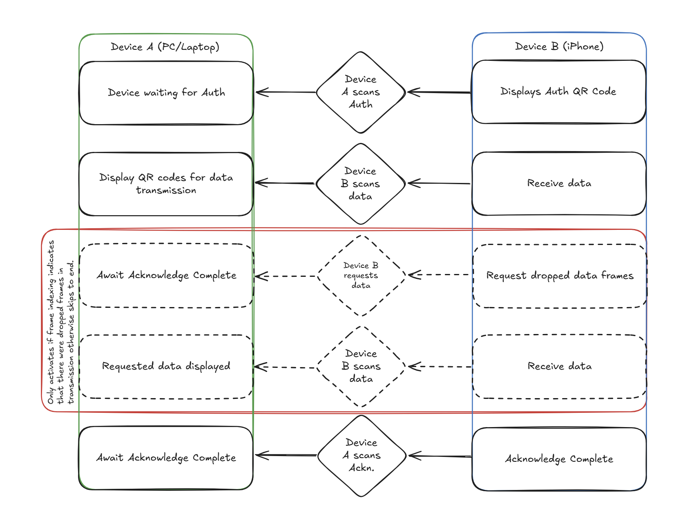
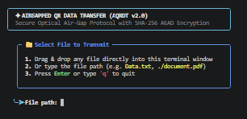
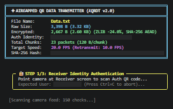
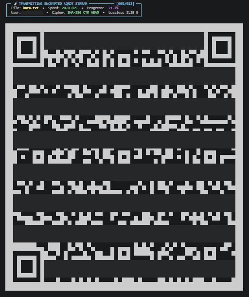
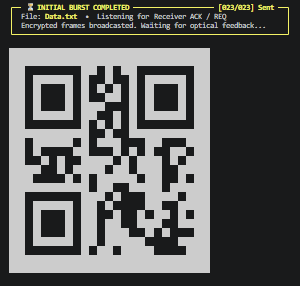
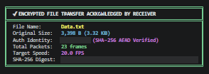

# Airgapped QR Data Transfer (AQRDT v2.0)

A high-speed, optical wireless air-gapped data transfer protocol designed for secure, internet-free communications between computers and devices using terminal QR streams, camera computer vision, dynamic user authentication, SHA-256 CTR AEAD file encryption, 100% lossless compression, and ARQ missing-frame retransmission.



---

## 🌟 Key Features in v2.0

1. **🔐 Dynamic User Authentication & Identifying Auth QR Codes**:
   - **Transmitter**: Stores authorized `AQRDT_USERNAME` and `AQRDT_PASSWORD` in a secure `.env` file.
   - **Receiver (Web & CLI)**: User enters their username and password which is transformed into a unique cryptographic Auth QR code (`AUTH|AQRDT|v2|<username>|<signature>`).
   - Transmitter verifies the identity and signature of the receiver before initiating the optical file stream.

2. **🛡️ End-to-End SHA-256 CTR AEAD File Encryption**:
   - Derives a 256-bit symmetric encryption key from the shared credentials and a 16-byte random session salt using SHA-256.
   - Encrypts payload with a high-speed SHA-256 CTR keystream stream cipher.
   - Authenticated Encryption with Associated Data (AEAD) via a 16-byte HMAC-SHA256 integrity tag preventing unauthorized decryption or tampering.

3. **🗜️ 100% Lossless High-Ratio Compression**:
   - Compresses data using ZLIB Level 9 before encryption, significantly reducing the number of optical QR frames required for transmission.
   - Bit-for-bit lossless decompression and SHA-256 hash validation before saving.

4. **🌐 Self-Contained Zero-Dependency Offline Web Receiver (`index_offline.html`)**:
   - Completely standalone HTML5 / PWA receiver with all engines inlined (`qrcodejs`, `jsQR`, `pako`, and `cryptojs`).
   - Runs directly in any web browser (`file:///` or offline web server) on phones, tablets, and laptops.
   - Interactive credentials bar, live Auth QR generation, real-time HUD, and automatic file download upon decryption.

5. **⚡ Continuous Streaming & Range-Compressed ARQ Retransmission**:
   - Optical streams run at high speeds (up to 20+ FPS).
   - Receiver requests missing packets via range-compressed NACKs (`REQ|<range>`).
   - Transmitter provides a 3-second preparation countdown before re-streaming missing frames at a steady retransmission FPS.

6. **💻 100% Headless Windowless CLI Operation**:
   - Renders high-contrast QR codes directly into Windows PowerShell / cmd / Linux terminals using full-block characters (`██` and `  `).
   - Zero GUI desktop dependencies (`cv2.imshow` is not needed).

---

## 📁 Directory Structure

```
Airgap QR Data Transfer/
  ├── V2/
  | ├── .env                 # Transmitter credentials configuration
  | ├── Duplex AQRDT.py      # Main Python Transmitter, Receiver & Simulator CLI
  | ├── index_offline.html   # Offline Web Receiver (Zero-dependency PWA)
  | ├── build_offline_pwa.py # Script to rebuild index_offline.html bundle
  | ├── test_aqrdt.py        # Comprehensive unit test suite
  | ├── Data.txt             # Sample data file for test transfers
  └── README.md              # Documentation
```

---

## ⚙️ Configuration (`.env`)

Create or edit `.env` in the `V2` directory:

```env
# Authorized Username
AQRDT_USERNAME=Nathaniel

# Secure Shared Password (used for authentication & SHA-256 key derivation)
AQRDT_PASSWORD=AirgapSecurePass2026!
```

---

## 🚀 How to Run

### 1. Transmitter (Sender) Mode
Run the Python transmitter and point the camera at the Receiver screen to authenticate and stream:

```bash
python "Duplex AQRDT.py" sender --file Data.txt --fps 20.0
```
*(You can also simply run `python "Duplex AQRDT.py"` to enter interactive file prompt / drag-and-drop mode).*

The following images depict the screens you will encounter when you run the program. Note that some of the screens have been altered to redact PII and other imformation.

1. Enter the filepath for the file that you want to transmit.


2. Waiting for receiver to authenticate


3. Data transmitted to receiver


4. Waiting for requests for retransmission of dropped packets or acknowledgement of completed transmission


5. Completed data transfer


### 2. Web Receiver Mode (`index_offline.html`)
1. Open `index_offline.html` in any browser (Chrome, Edge, Safari, Firefox).
2. Enter your **Username** and **Password** (defaults match `.env`).
3. Point the Transmitter camera at the displayed Auth QR code.
4. Once the stream begins, point the Receiver camera at the Transmitter's terminal screen.
5. Upon reception, the file is automatically decrypted, decompressed, verified, and downloaded!

### 3. CLI Terminal Receiver Mode
To receive files on a second terminal/headless machine:

```bash
python "Duplex AQRDT.py" receiver --output ./received_files
```

### 4. Automated Simulation Mode (Hardware-Free Testing)
To verify loopback transmission, packet loss recovery, encryption, and decompression:

```bash
python "Duplex AQRDT.py" simulate --drop-rate 0.3
```

---

## 🧪 Running Unit Tests

Run the full automated test suite:

```bash
python test_aqrdt.py
```

Tests verify:
- Dynamic Auth QR signatures and verification
- 100% Lossless ZLIB compression and decompression
- SHA-256 CTR AEAD encryption and decryption
- Tamper detection and wrong password rejection
- Range compression and ARQ decompress algorithms
- Per-packet CRC32 validation
- Terminal block QR rendering
